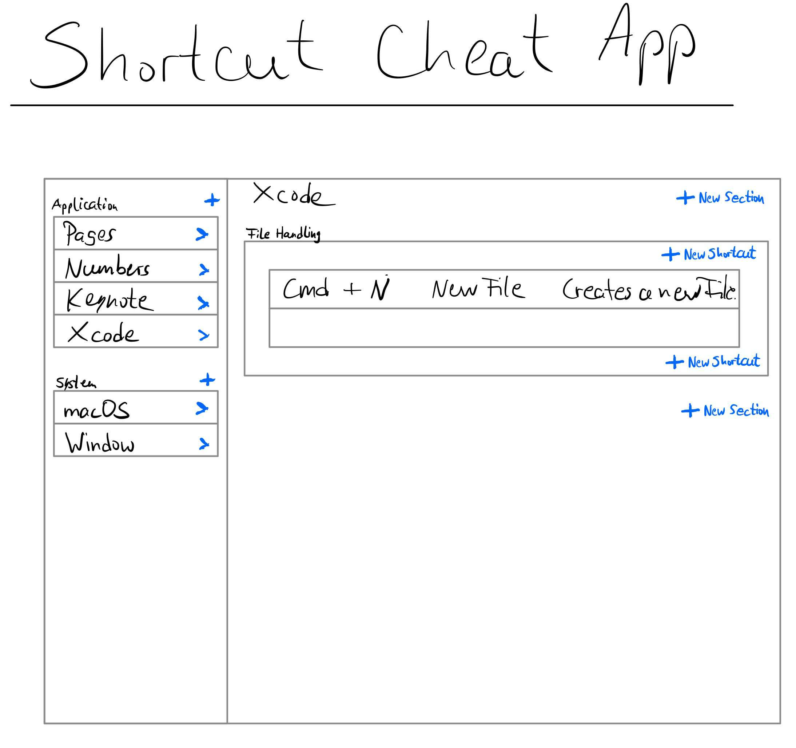

# Appfrosch's Shortcut Cheat App

The first "design"…

## Elevator Pitch
Appfrosch's Shortcut Cheat App is helping all the keyboard shortcut aficionados (like myself) out there by giving them a tool to store their frequently (or sometime not so frequently…) used shortcuts.

## My goals are…
… having an app that I can create/lookup my used shortscuts with
… having an app on the app store asap
… documenting my jearney (as a lot of folks did before, which I liked)
… creating a full stack system with synchronisation by using Server Side Swift (out of scope for MVP)
… creating and managing a public repository on GitHub

My expectation is not that I will have a large userbase or make any money with it – though I would not want exclude that possibility at all...

## Modus Operandi
I want to do the process "in the open" – even though I don't have any expectations at all. Chances are that nobody will see these lines, but I would be excited if I am wrong here. We will see...
We will also see how much open the "in the open" will be, I guess that will depend on my schedule and on whether or not this will be interesting to anybody at all...

## Who am I?
I am a late starter in programming, by no means a professional when it comes to Swift/SwiftUI etc., but I think that I am knowledgable enough at this point to be dangerous (whatever that means...).
In the recent years, I had some professional development leading to a change of careers at my employe's changing from being a System Engineer to becoming an Application Developer. So even though this is my profession now, I am a) despite my progress in age still a beginner and b) not a Swift/SwiftUI developer, as the programming paradigms and the language (4D) are totally different.

So far, I have been consuming a lot of stuff related to Swift/SwiftUI in the Apple environment – be it blogposts, podcasts, YouTube videos etc. – and I have been trying some things privately

## Target Systems
The application is supposed to be running on 
- macOS
- iPadOS
- iOS

To be able to target all of the above systems, the SDK I am going to use will be SwiftUI with the SwiftUI lifecycle introduced this year (which is the infamous year 2020…). As this will be a little side project for me, I guess it does not really matter to exclude all users prior to macOS 11 or iPad/iOS 14 at this stage.

Through cloud syncing, the user should be able to look up her/his shortcuts on any of the above devices. 

## Minimal Viabal Product (MVP)
The following features are necessary for my MVP:
- sidepanel with an overview over systems and applications
- main area with the corresponding shortcuts

Out of scope at this stage is:
- cloud syncing
